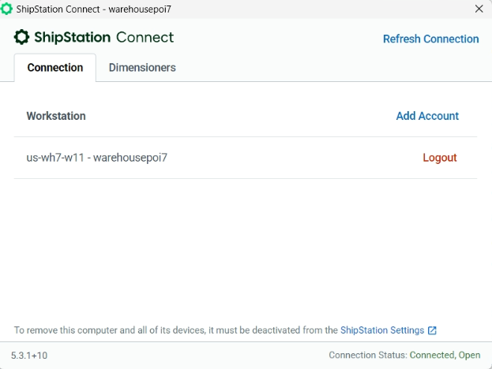
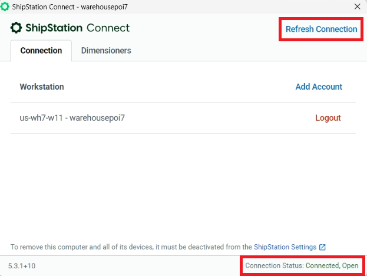
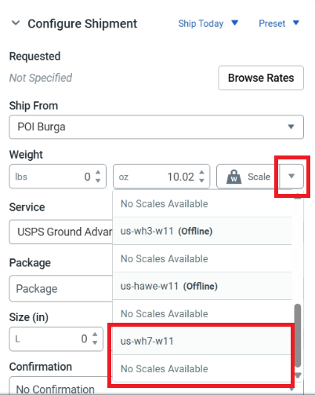
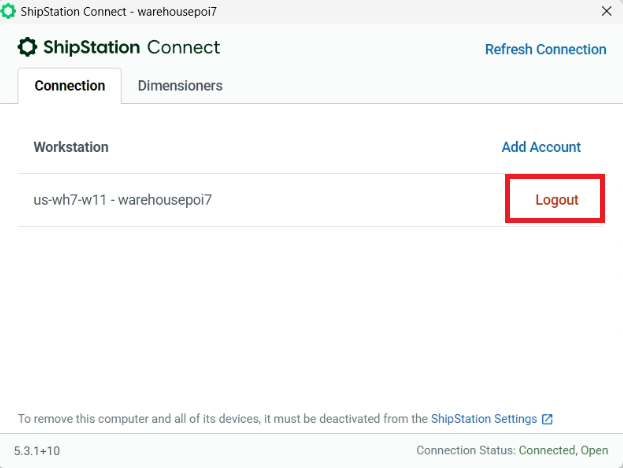
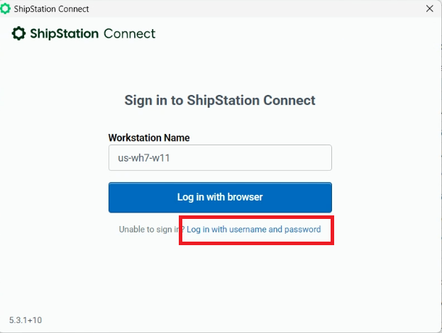
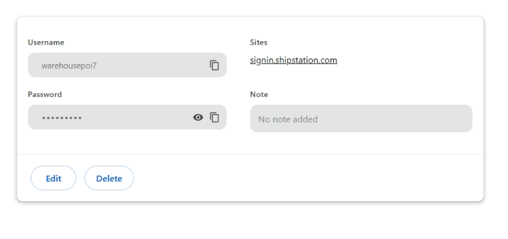

# 🧰 Scales Not Working (Fix)

If your scales are not working in **Shipstation**, follow these steps carefully.

---

## ⚙️ Step 1 — Make sure Shipstation Connect is turned on

Always verify that the **Shipstation Connect** app is running in the background.

---

## 🔄 Step 2 — Check the connection status

1. Open **Shipstation Connect**.  
2. Look at the **status bar at the bottom** — it should show if it’s connected.  
3. Click **“Refresh Connection”** (top-right corner of the app).  
4. Then refresh your **Shipstation** page in the browser.

---

## 🧾 Step 3 — Verify scales in the browser

If the issue persists:

1. Open any **order** in Shipstation.  
2. Check if the **scales are visible and selected**.  

3. If not — try **unplugging and plugging the scales back in**.

---

## 🔐 Step 4 — Re-login to Shipstation Connect

1. Open **Shipstation Connect** desktop app.  
2. Click **Logout**.  

3. Log back in **using your username and password**, **not via browser**.

You can find the workstation login details in Chrome’s password manager:  
👉 [chrome://password-manager/passwords](chrome://password-manager/passwords)

Copy the login details and sign in again.

✅ Once logged in, confirm that the connection status says **“Connected.”**

---

## 🖥️ Step 5 — Reboot the computer

If none of the above helped:
- **Reboot the PC.**
- If the issue persists after reboot, **contact the IT team** for further assistance.

---

> 💡 **Tip:** Most scale connection problems are caused by Shipstation Connect not running or being logged in incorrectly.
